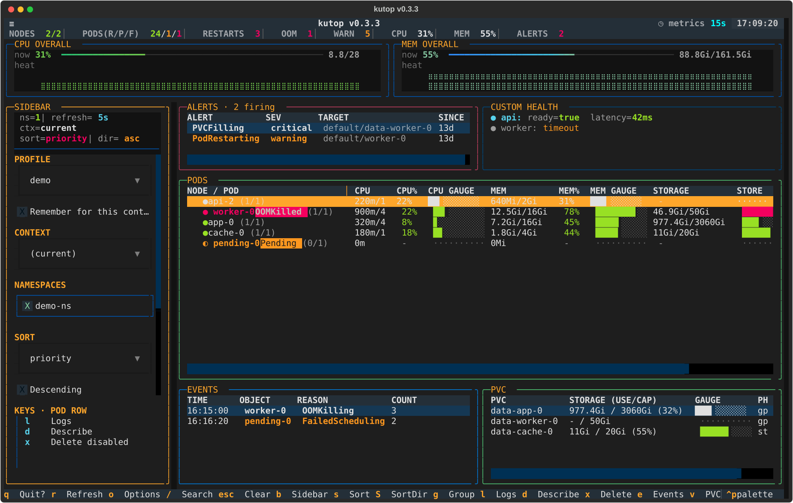
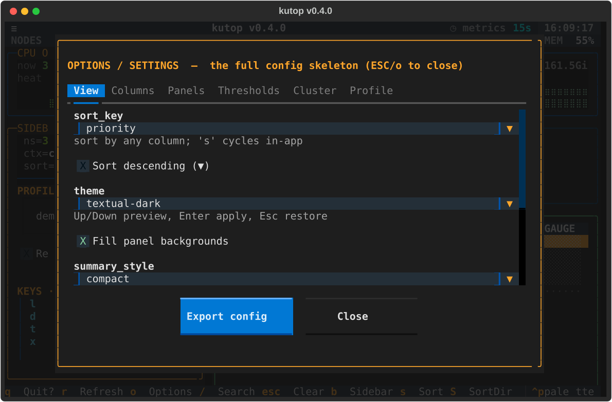
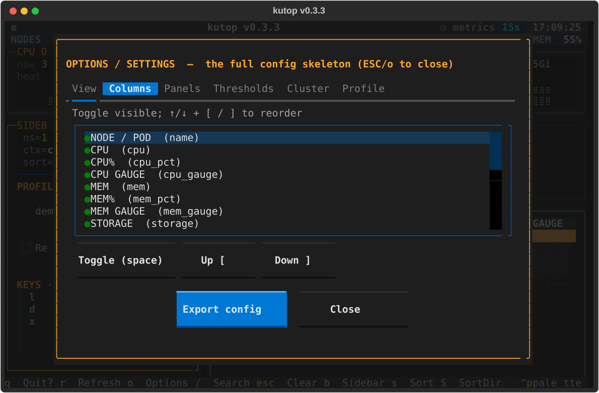
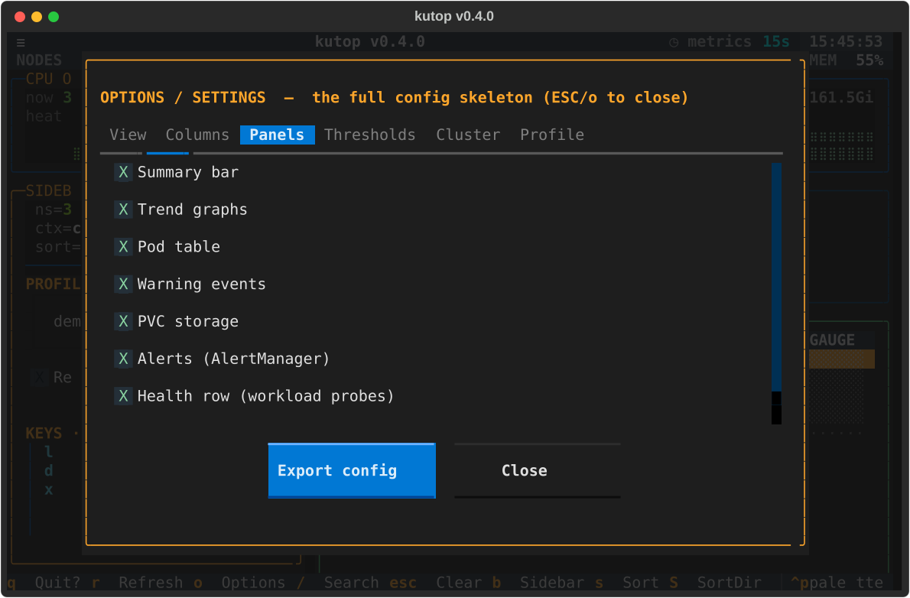
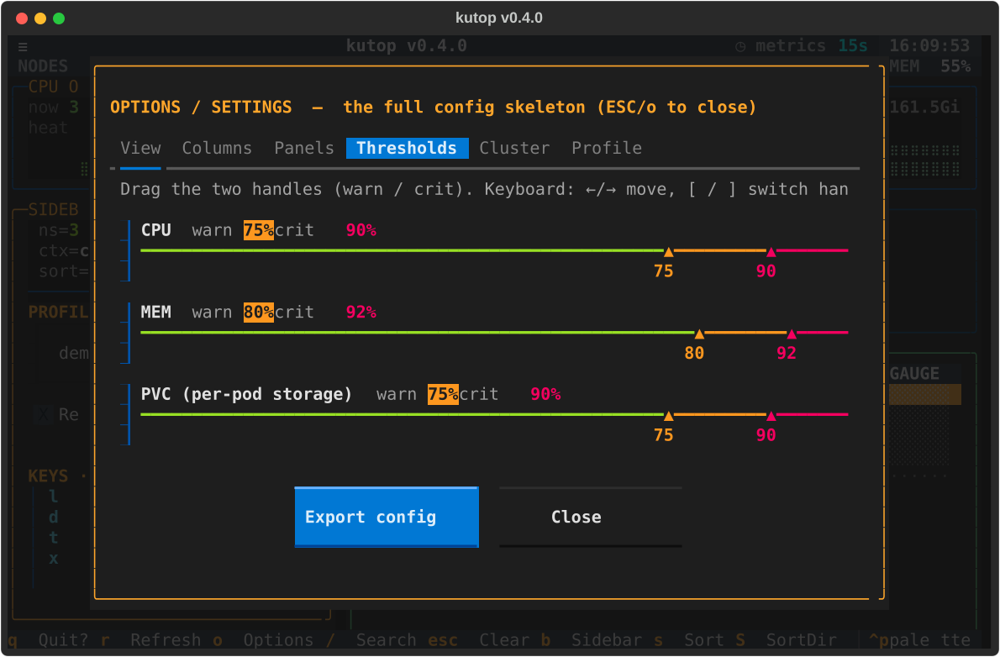
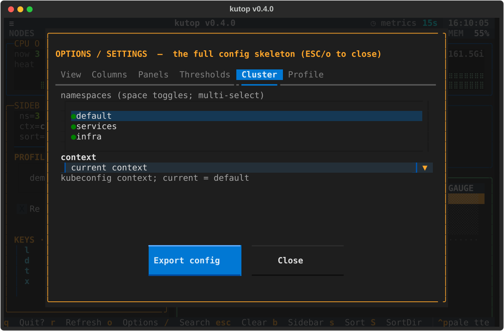
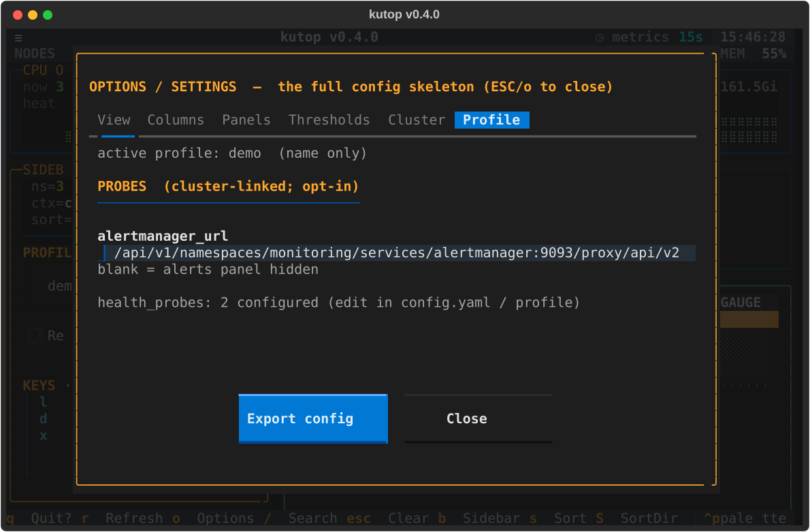

# kutop

[](https://github.com/ken-jo/kutop/releases)
[](https://pypi.org/project/kutop/)
[](https://pypi.org/project/kutop/)
[](https://github.com/ken-jo/kutop/actions/workflows/ci.yml)
[](https://github.com/ken-jo/kutop/actions/workflows/release.yml)
[](pyproject.toml)
[](https://kubernetes.io/releases/version-skew-policy/)
[](https://kubernetes-sigs.github.io/metrics-server/)
[](LICENSE)
[](https://github.com/ken-jo/kutop/issues)
[](https://github.com/ken-jo/kutop/stargazers)
[](https://github.com/ken-jo/kutop/commits/master)

`kutop` is a modern, like-btop **Kubernetes TUI dashboard** for the terminal. It
turns `kubectl` and your kubeconfig into a fast, readable view of pods, nodes,
namespaces, CPU, memory, restarts, OOMKilled pods, warning events, PVC storage,
Alertmanager alerts, and custom health checks.

It is built with [Textual](https://textual.textualize.io/) and runs locally with
no in-cluster agent. `kutop` is useful when you want a Kubernetes terminal
dashboard, pod monitor, node resource view, k8s observability console, or a
`kubetop`/`ktop` style CLI that feels closer to `btop`.

## Highlights

* Kubernetes pod and node monitoring directly in the terminal.
* Live CPU and memory trend sparklines plus per-pod usage-vs-limit gauges.
* Problem-first signals for Pending, Failed, OOMKilled, CrashLoopBackOff, and
  restarting workloads.
* Optional Events, PVC storage, Alertmanager, health-check, and contextual Keys
  sidebar panels.
* Multi-namespace views, sorting, filtering, grouping, and a configurable
  sidebar for fast cluster triage.
* Profile-driven thresholds, pod ordering, timezone, alert sources, and health
  probes so the core stays generic.
* Headless SVG screenshots for README assets, release notes, and visual QA.

```
NODES 2/2 │ PODS(R/P/F) 18/1/0 │ RESTARTS 7 │ OOM 1 │ WARN 2 │ ALERTS 3
CPU OVERALL  ▁▂▃▅▆▇█  62%  5.1/16        MEM OVERALL  ▃▄▅▆▇█  74%  47/64Gi
◆ worker-pool  node-a │
  ● api-0 (1/1)        ███████░░░ 70%   STS
  ● worker-9 OOMKilled (0/1)  █████████░ 95%   Deploy
```

## Requirements

`kutop` is a local terminal app. It does not install an in-cluster agent; it
uses your local `kubectl` and kubeconfig exactly as `kubectl` would.

| Dependency | Required version / contract | Used for |
|------------|-----------------------------|----------|
| Python | 3.9+ | running the installed `kutop` package |
| Textual / Rich | `textual==8.2.7`, `rich==15.0.0` | terminal UI rendering |
| kubectl | installed on `PATH`; use a client within +/- 1 minor version of your cluster's kube-apiserver | all live cluster reads and actions |
| kubeconfig | current context from `~/.kube/config`, `KUBECONFIG`, or `--context` | cluster auth and target selection |
| Metrics Server | 0.6.x+ on Kubernetes 1.19+ recommended | `kubectl top` CPU/MEM metrics |

Live dashboard mode requires `kubectl`. `kutop --self-test` and
`kutop --dump-config` are cluster-free and do not require `kubectl`.

CPU and memory values use `kubectl top nodes` and
`kubectl top pods --containers`, then sum container rows so multi-container pods
show pod-level usage. If container-level `top` is unavailable, `kutop` falls
back to pod-level `kubectl top pods`.

On live startup, `kutop` checks `kubectl top nodes` plus the
`metrics.k8s.io` discovery endpoint. If Metrics Server appears absent and the
terminal is interactive, `kutop` asks before changing the cluster. Pressing `y`
runs the official components manifest:

```bash
kubectl apply -f https://github.com/kubernetes-sigs/metrics-server/releases/latest/download/components.yaml
```

Pressing `N` leaves the cluster unchanged and prints both the components
manifest path and the official Helm route for review. Use
`--no-metrics-bootstrap` or `KUTOP_NO_METRICS_BOOTSTRAP=1` to skip this startup
prompt in scripted runs.

PVC storage usage is fetched through the Kubernetes API-server proxy with
`kubectl get --raw /api/v1/nodes/<node>/proxy/stats/summary`; this reuses the
same kubeconfig auth and does not need a localhost port-forward.

RBAC needs depend on which panels/actions you use:

* Core dashboard: `get/list` pods, nodes, events, and PVCs in the selected
  namespaces.
* CPU/MEM metrics: access to the Metrics API used by `kubectl top`.
* PVC usage and profile proxy URLs: permission for `get --raw` API-server proxy
  paths.
* Logs/describe/delete: the corresponding pod `logs`, `get`, or `delete`
  permissions. Delete stays disabled until you turn on the **Allow delete**
  toggle in the sidebar (or launch with `--allow-destructive`, which just seeds
  that toggle on) AND accept the confirmation popup. The toggle is not persisted
  — it resets to off on each launch.

## Install

```bash
python -m pip install kutop
python -m pip install "kutop[profiles]"   # backward-compatible; YAML support is built in
python -m pip install "kutop[profiles] @ git+https://github.com/ken-jo/kutop.git"
python -m pip install "kutop @ git+https://github.com/ken-jo/kutop.git@v0.2.2"
python -m pip install -e ".[profiles]"   # local development from this directory
```

The project name, PyPI distribution, and Python package namespace are `kutop`.
The `kubetop` command and `python -m kubetop` remain available only as
compatibility aliases:

```bash
kutop --version
kubetop --version
python -m kutop --version
python -m kubetop --version
```

The PyPI name `kubetop` belongs to a different package. Pinned deps:
`textual==8.2.7`, `rich==15.0.0`. Python 3.9+.

`pip install @ken-jo/kutop` is not valid pip syntax; use `pip install kutop`
for PyPI releases, or the `kutop @ git+https://...` form for a GitHub branch,
commit, or tag.

Other package managers after a tagged release:

```bash
brew tap ken-jo/kutop
brew install kutop

# One-shot install without a separate tap step:
brew install ken-jo/kutop/kutop

curl -fsSL https://ken-jo.github.io/kutop/apt/kutop.gpg \
  | sudo gpg --dearmor -o /usr/share/keyrings/kutop-archive-keyring.gpg
echo "deb [signed-by=/usr/share/keyrings/kutop-archive-keyring.gpg] https://ken-jo.github.io/kutop/apt stable main" \
  | sudo tee /etc/apt/sources.list.d/kutop.list
sudo apt update
sudo apt install kutop
```

Release setup for PyPI, Homebrew, and apt is documented in
[`docs/release.md`](docs/release.md).

## Run

```bash
kutop                               # generic view, namespace 'default'
kutop demo-ns                       # namespace demo-ns
kutop ns-a,ns-b                     # multiple namespaces (comma list)
kutop --profile example             # load a profile (ordering / tz / thresholds)
python -m kutop demo-ns             # module form
python -m kubetop demo-ns           # legacy module alias
kutop --context demo-context demo-ns  # pick a kubeconfig context
kutop --allow-destructive           # start with the 'Allow delete' toggle on (still confirm-gated)
kutop --no-metrics-bootstrap        # skip startup Metrics Server prompt
kutop --dump-config                 # print the full annotated config skeleton
kutop --self-test                   # headless smoke test (no cluster), exits 0
kutop --snapshot out.svg            # render one frame to SVG and exit
kutop --snapshot out.svg --detail full  # wider diagnostic capture
```

The positional `namespaces` only seeds the first run; your in-app choices are
saved to `~/.config/kutop/config.yaml` and win on the next launch. The refresh
cadence is fixed at 5s and is no longer configurable — a legacy second
positional (`kutop demo-ns 3`) is still accepted but ignored, with a one-line
notice. CPU/MEM metrics come from metrics-server, whose default scrape
resolution is 15s, so the header shows a fixed `metrics 15s` freshness readout
(polling faster than that would just re-show identical values).

## Keybindings

| Key | Action |
|-----|--------|
| `q` `q` | quit (first press shows a confirmation toast) |
| `r` | refresh now |
| `o` | options / settings (tabbed: View, Columns, Panels, Thresholds, Cluster, Profile) |
| `Tab` / `b` | toggle the control sidebar |
| `/` | search / filter pods by name |
| `s` / `S` | cycle sort column / flip sort direction (or click a column header) |
| `g` | group pods under their node |
| `l` | live logs for the focused pod (`kubectl logs -f`) |
| `d` | describe the focused pod |
| `x` | delete the focused pod (needs the sidebar **Allow delete** toggle on, then confirm) |
| `e` / `v` | toggle the Events / PVC panels |
| `a` / `h` | toggle the Alerts / Health panels (profile-driven) |
| `R` | reload `~/.config/kutop/config.yaml` live |

The **NODE/POD column is resizable**: drag the `│` handle on its header to widen
or narrow it (the width persists). Click any column header to sort by it.

The sidebar Keys panel intentionally shows only the current work context. For
example, a focused pod row surfaces `l` logs, `d` describe, and `x` delete, while
the search bar surfaces `/`, `Enter`, and `Esc`; global shortcut summaries stay
in the footer and native help.

## Screenshots

`kutop` can render a headless SVG frame for README images, reviews, and visual
QA. It uses live cluster data when reachable and falls back to a generic
synthetic frame when not.

Main dashboard with every panel enabled: Summary, Trends, Alerts, the custom
Health plugin panel, Pods, Events, and PVC storage:



Options modal views:

| View | Columns | Panels |
|------|---------|--------|
|  |  |  |

| Thresholds | Cluster | Profile |
|------------|---------|---------|
|  |  |  |

```bash
kutop --snapshot /tmp/kutop.svg
kutop --snapshot /tmp/kutop-wide.svg --detail wide
kutop --snapshot /tmp/kutop-full.svg --detail full
kutop --snapshot /tmp/kutop-full.svg --detail full --size 220x54
kutop --snapshot /tmp/kutop-options.svg --snapshot-view options-panels --size 96x30
```

The detail presets are one-shot column layouts:

| Detail | Default size | Use |
|--------|--------------|-----|
| `normal` | `140x40` | Same visible columns as the interactive default |
| `wide` | `160x44` | Prioritises namespace, readiness, phase, reason, owner, node, and key resources |
| `full` | `220x54` | Enables every table column and the PVC panel; increase `--size` for far-right columns |

`--snapshot-view` accepts `main`, `options-view`, `options-columns`,
`options-panels`, `options-thresholds`, `options-cluster`, and
`options-profile`.

## Profiles

A profile externalises everything that would otherwise be hardcoded. See
[`kutop/profiles/example.yaml`](kutop/profiles/example.yaml) for a fully
commented template:

```yaml
name: my-stack
context: ""                   # optional kube context to switch to; "" -> keep current
namespaces: [team-a, team-b]
timezone: ""                  # "" -> host local tz; or an IANA name
ordering:
  - { prefix: ingress-, weight: 10 }
  - { prefix: api-,     weight: 20 }
thresholds:
  cpu_warn: 75
  cpu_crit: 90
  mem_warn: 80
  mem_crit: 92
# alertmanager_url: "/api/v1/namespaces/monitoring/services/<svc>:9093/proxy/api/v2/alerts"
```

Profiles resolve by name from `~/.config/kutop/profiles/<name>.yaml` and the
packaged `kutop/profiles/` directory, or by explicit path. Without a profile
the core runs fully (alphabetical ordering, local timezone, generic thresholds).

The active profile can also be **switched live** from the **PROFILE** dropdown
at the top of the sidebar (`Tab`/`b`). The list is discovered from your profile
directories (plus `generic` for the no-profile default); selecting one re-applies
that profile's ordering, namespaces, timezone, thresholds, alert source, and
health probes immediately, and refetches at once. If the profile sets a
`context:`, selecting it also switches to that kube context (cluster) — so a
profile can bundle "which cluster + how to view it"; leave it empty to keep the
current context.

Above PROFILE, the sidebar's **CONTEXT** dropdown switches the active kube
context (cluster) on its own — for hopping between clusters without a profile.
Its list is discovered from your kubeconfig; selecting one rewires the fetcher,
re-discovers that cluster's namespaces, and refetches immediately. (`o` →
Cluster also has the same picker, and `--context` still works at launch.)

By default a live switch is session-only. Tick **Remember for this context**
(below the dropdown) to persist the choice **keyed by your current kube context**:
kutop stores a `context → profile` map (`profiles_by_context`) in
`~/.config/kutop/config.yaml` and, on the next launch without `--profile`,
auto-loads the profile remembered for the active context — so each cluster keeps
its own workload profile. An explicit `--profile` always wins and skips the
lookup. This is stored in kutop's own config only; kutop never writes to your
kubeconfig.

## Alerts & custom panels (no port-forward)

The Alerts and custom Health panels are opt-in and profile-driven. A
`/`-prefixed URL in `alertmanager_url` / `health_probes[].url` is fetched via
`kubectl get --raw` through the Kubernetes **API-server proxy**, so it uses your
kubeconfig auth with no localhost port-forward. Health is a self-contained
custom panel plugin (`kutop/plugins/health.py`); the core does not depend on it.

To update the custom panel without changing code, edit a profile or
`~/.config/kutop/config.yaml`:

```yaml
panels:
  keys: true
  health: true
probes:
  health_probes:
    - name: api
      url: /api/v1/namespaces/default/services/api/proxy/health
      fields:
        ready: "ready=(\\w+)"
        latency: "latency_ms=(\\d+)"
    - name: worker
      url: /api/v1/namespaces/default/services/worker/proxy/metrics
      fields:
        lag: "queue_lag=(\\d+)"
```

For a new code-backed custom panel, use the existing plugin seam:

1. Add a module under `kutop/plugins/<name>.py`.
2. Expose a `PLUGIN` object with `panel_id`, `is_enabled(config)`,
   `fetch(fetcher, snapshot)`, `make_panel()`, and `render(panel, snapshot)`.
3. Append the module path to `_BUILTIN_PLUGIN_MODULES` in
   `kutop/plugins/__init__.py`.
4. Keep plugin fetch/render best-effort: a custom panel must never crash the
   main Kubernetes dashboard.

## How it works

* kubectl calls run in a background thread worker; the UI thread never blocks,
  and a refresh is skipped while one is in flight (no thrashing on slow clusters).
* Node/pod CPU & memory come from `kubectl top` + `kubectl get -o json`.
* PVC usage comes from the kubelet summary API
  (`/api/v1/nodes/<node>/proxy/stats/summary`) because metrics-server does not
  expose it — a node whose summary call fails is skipped, others still report.
* OOMKilled / CrashLoopBackOff / Pending pods are highlighted distinctly; node
  rows lead with the nodegroup (EKS/GKE/AKS label), then the short instance name.

## License

MIT. See [LICENSE](LICENSE).
