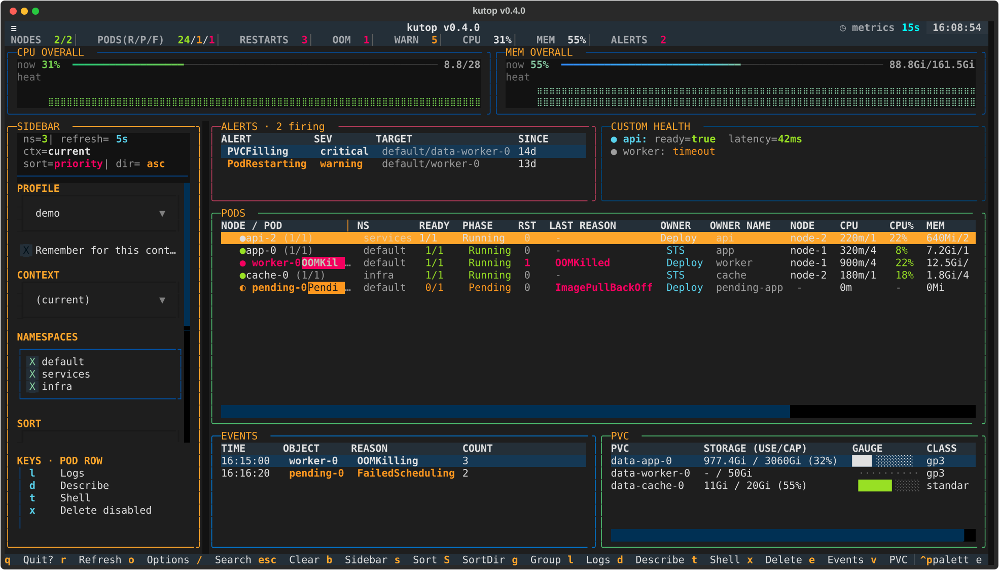

# kubetop

A modern, btop-style **Kubernetes resource dashboard** for the terminal, built
with [Textual](https://textual.textualize.io/). It attaches to any cluster /
namespace, shows live CPU/MEM trend sparklines, an aggregate counter bar, and
per-pod usage-vs-limit gauges — so you can read the state of a cluster in a few
seconds. Workload-specific behaviour (pod ordering, timezone, thresholds, alert
sources, health probes) is injected declaratively via **profiles**, keeping the
core generic.

```
NODES 2/2 │ PODS(R/P/F) 18/1/0 │ RESTARTS 7 │ OOM 1 │ WARN 2 │ ALERTS 3
CPU OVERALL  ▁▂▃▅▆▇█  62%  5.1/16        MEM OVERALL  ▃▄▅▆▇█  74%  47/64Gi
◆ worker-pool  node-a │
  ● api-0 (1/1)        ███████░░░ 70%   STS
  ● worker-9 OOMKilled (0/1)  █████████░ 95%   Deploy
```

## Install

```bash
python -m pip install "git+https://github.com/ken-jo/kutop.git"
python -m pip install "kubetop[profiles] @ git+https://github.com/ken-jo/kutop.git"
python -m pip install -e ".[profiles]"   # local development from this directory
```

This project is installed from GitHub/source for now; the PyPI name `kubetop`
belongs to a different package. Pinned deps: `textual==8.2.7`, `rich==15.0.0`.
Python 3.9+.

## Run

```bash
kubetop                             # generic view, namespace 'default'
kubetop demo-ns 3                   # namespace demo-ns, 3s refresh
kubetop ns-a,ns-b                   # multiple namespaces (comma list)
kubetop --profile example           # load a profile (ordering / tz / thresholds)
python -m kubetop demo-ns 3         # module form
kubetop --context demo-context demo-ns  # pick a kubeconfig context
kubetop --allow-destructive         # enable pod delete (still confirm-gated)
kubetop --dump-config               # print the full annotated config skeleton
kubetop --self-test                 # headless smoke test (no cluster), exits 0
kubetop --snapshot out.svg          # render one frame to SVG and exit
kubetop --snapshot out.svg --detail full  # wider diagnostic capture
```

Positional `namespaces`/`interval` only seed the first run; your in-app choices
are saved to `~/.config/kubetop/config.yaml` and win on the next launch.

## Keybindings

| Key | Action |
|-----|--------|
| `q` | quit |
| `r` | refresh now |
| `o` | options / settings (tabbed: View, Columns, Panels, Thresholds, Cluster) |
| `Tab` / `b` | toggle the control sidebar |
| `/` | search / filter pods by name |
| `s` / `S` | cycle sort column / flip sort direction (or click a column header) |
| `g` | group pods under their node |
| `l` | live logs for the focused pod (`kubectl logs -f`) |
| `d` | describe the focused pod |
| `x` | delete the focused pod (only with `--allow-destructive`, then confirm) |
| `e` / `v` | toggle the Events / PVC panels |
| `a` / `h` | toggle the Alerts / Health panels (profile-driven) |
| `R` | reload `~/.config/kubetop/config.yaml` live |

The **NODE/POD column is resizable**: drag the `│` handle on its header to widen
or narrow it (the width persists). Click any column header to sort by it.

## Screenshots

`kubetop` can render a headless SVG frame for README images, reviews, and visual
QA. It uses live cluster data when reachable and falls back to a generic
synthetic frame when not.



```bash
kubetop --snapshot /tmp/kubetop.svg
kubetop --snapshot /tmp/kubetop-wide.svg --detail wide
kubetop --snapshot /tmp/kubetop-full.svg --detail full
kubetop --snapshot /tmp/kubetop-full.svg --detail full --size 220x54
```

The detail presets are one-shot column layouts:

| Detail | Default size | Use |
|--------|--------------|-----|
| `normal` | `140x40` | Same visible columns as the interactive default |
| `wide` | `160x44` | Prioritises namespace, readiness, phase, reason, owner, node, and key resources |
| `full` | `220x54` | Enables every table column and the PVC panel; increase `--size` for far-right columns |

## Profiles

A profile externalises everything that would otherwise be hardcoded. See
[`kubetop/profiles/example.yaml`](kubetop/profiles/example.yaml) for a fully
commented template:

```yaml
name: my-stack
namespaces: [team-a, team-b]
timezone: ""                  # "" -> host local tz; or an IANA name
ordering:
  - { prefix: ingress-, weight: 10 }
  - { prefix: api-,     weight: 20 }
thresholds:
  cpu_warn: 75
  cpu_crit: 90
  mem_warn: 80
  mem_crit: 92
# alertmanager_url: "/api/v1/namespaces/monitoring/services/<svc>:9093/proxy/api/v2/alerts"
```

Profiles resolve by name from `~/.config/kubetop/profiles/<name>.yaml` and the
packaged `kubetop/profiles/` directory, or by explicit path. Without a profile
the core runs fully (alphabetical ordering, local timezone, generic thresholds).

## Alerts & health (no port-forward)

The Alerts and Health panels are opt-in and profile-driven. A `/`-prefixed URL
in `alertmanager_url` / `health_probes[].url` is fetched via `kubectl get --raw`
through the Kubernetes **API-server proxy** — so it uses your kubeconfig auth
with no localhost port-forward. Health is a self-contained plugin
(`kubetop/plugins/health.py`); the core does not depend on it.

## How it works

* kubectl calls run in a background thread worker; the UI thread never blocks,
  and a refresh is skipped while one is in flight (no thrashing on slow clusters).
* Node/pod CPU & memory come from `kubectl top` + `kubectl get -o json`.
* PVC usage comes from the kubelet summary API
  (`/api/v1/nodes/<node>/proxy/stats/summary`) because metrics-server does not
  expose it — a node whose summary call fails is skipped, others still report.
* OOMKilled / CrashLoopBackOff / Pending pods are highlighted distinctly; node
  rows lead with the nodegroup (EKS/GKE/AKS label), then the short instance name.

## License

MIT. See [LICENSE](LICENSE).
